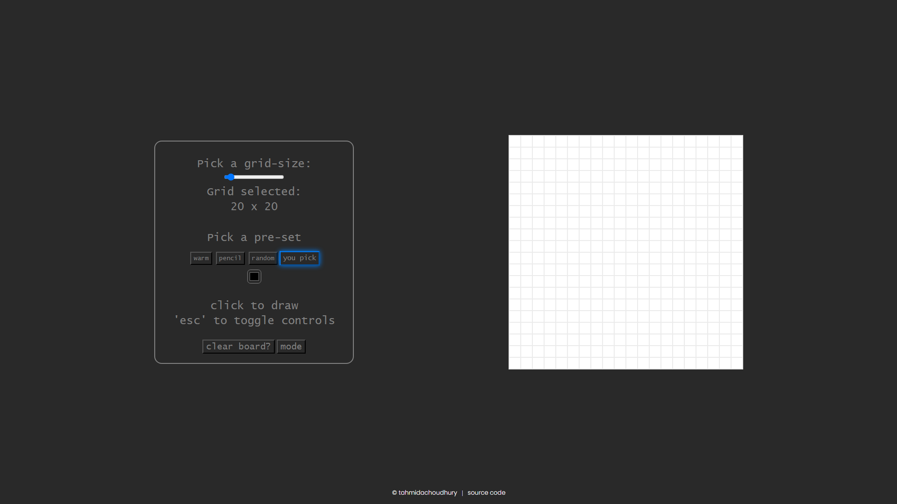
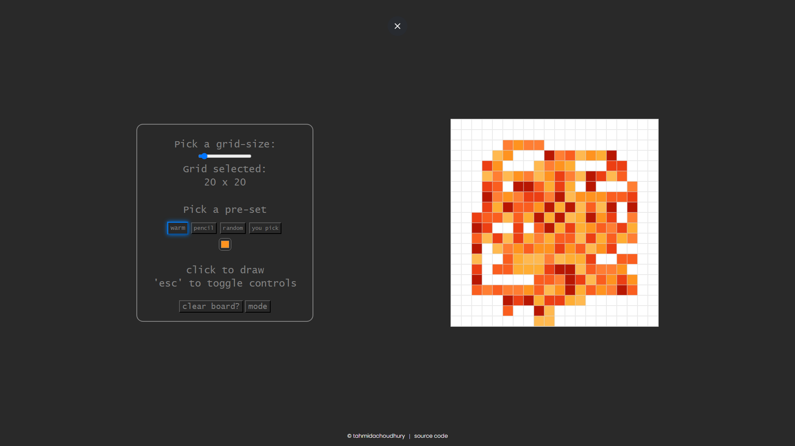
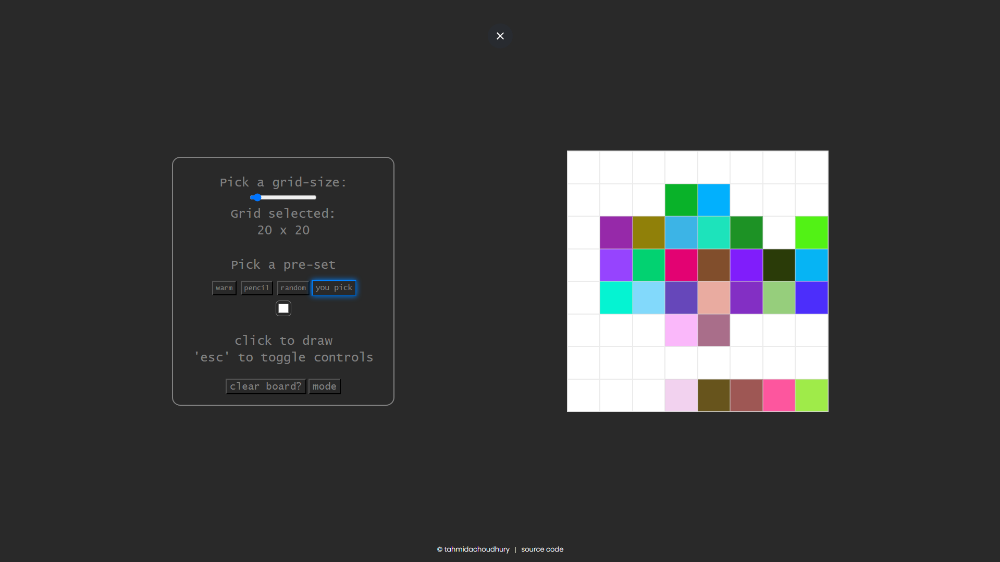
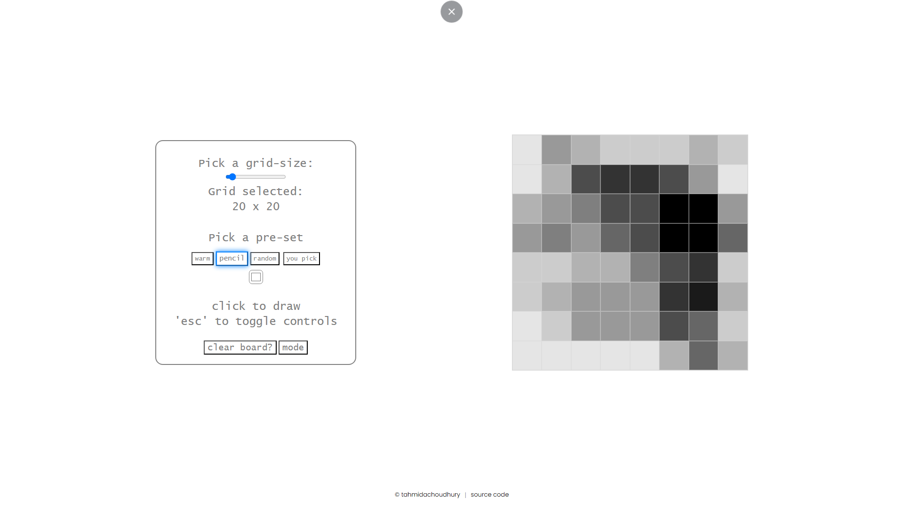

# Etch-A-Sketch

[](https://github.com/tahmidachoudhury/jubilant-fiesta)

---

## Table of Contents

- [Overview](#overview)
- [Features](#features)
- [Screenshots](#screenshots)
- [Contact](#contact)

---

## Overview

A simple etch-a-sketch style webpage. I built this as a part of The Odin Project learning curriculum.

---

## Features

- **Feature 1:** Warm colour feature.
- **Feature 2:** Random colour feature.
- **Feature 3:** Pencil feature.

---

## Installation

Follow these steps to get your development environment set up:

1. **Clone the repository:**
   ```bash
   git clone https://github.com/tahmidachoudhury/jubilant-fiesta
   cd yourrepo
   ```

---

## Screenshots

Below are some screenshots that provide a visual overview of the project:

### Main Interface


_The main screen that defaults in dark mode. Here you can interact with all the different features._

### Feature 1: Warm Colour


_This feature is essentially a preset of "warm" hex values. This is implemented by a few lines of code that randomises the hex value in a given array._

### Feature 2: Random Colour


_This feature randomizes the hex value. This code was difficult to implement, so I used stack overflow for help._

### Feature 3: Pencil


_This pencil feature changes the opacity of the square from light to dark. Due to the opacity changing, this feature doesn't show in dark mode. I will need to come back to this._

---

## Contact

If you have any questions, suggestions, or feedback, feel free to reach out!

- **Email:** [tahmidachoudhury@outlook.com](mailto:tahmidachoudhury@outlook.com)
- **LinkedIn:** [Your Name](https://www.linkedin.com/in/tahmid-choudhury-a1a05a252)
